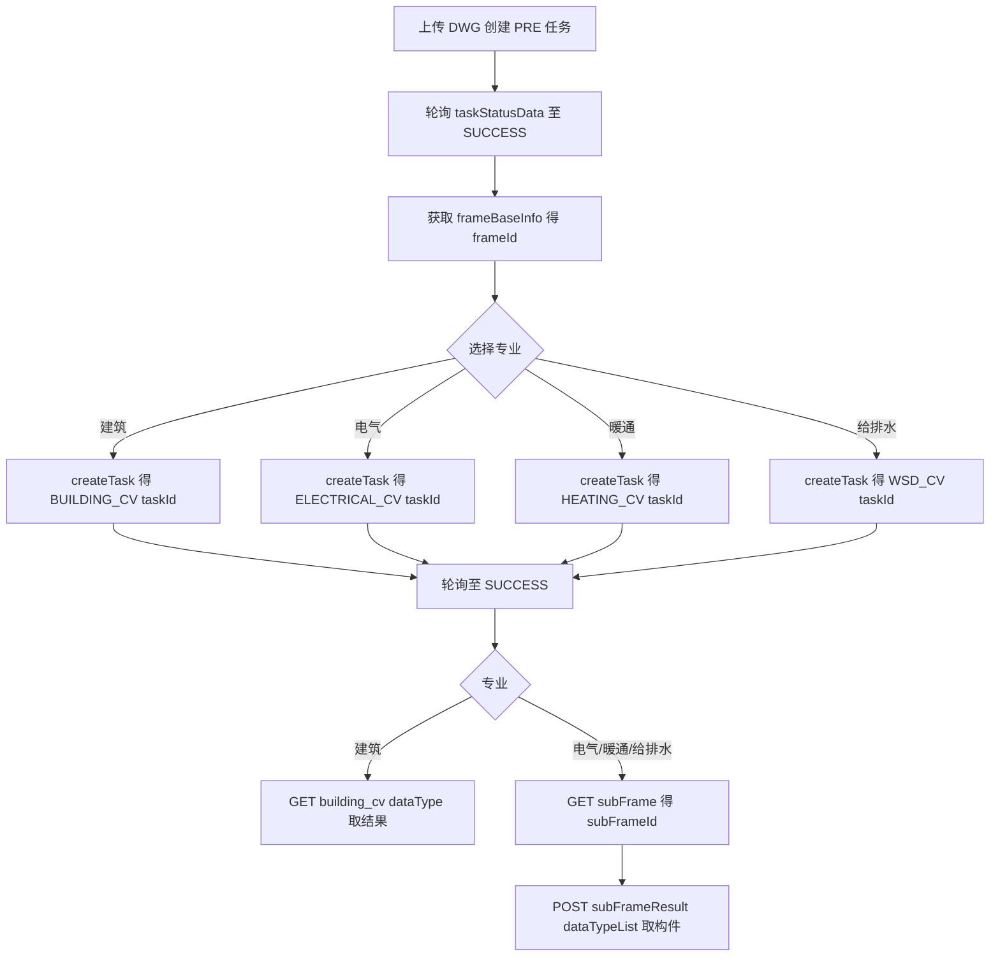

# bangtu-open-mcp 接口契约与工具设计文档

> 状态：建筑、电气专业已发布；暖通、给排水已随上游测试环境 API 上线而开放（接口路径基于测试环境 apidoc 与后端 DataTypeEnum.java 固化，正式 API 上线后即对生产生效）
> 目标：将帮图开放 API 的接口契约固化进 MCP 工具定义，使文档页面下线后 MCP 仍能独立工作，让 agent 开箱即用地拿到 DWG 图纸解析内容。

---

## 1. 背景与目标

当前 [`src/index.ts`](../src/index.ts) 是一个"泛化透传代理"，存在三个致命问题：

1. **基础地址错误**：代码写的是 `https://api.bangtu-ai.com`，真实地址是 `https://openapi.bangtu-ai.com/openApi`。
2. **认证方式错误**：代码默认 `Authorization: Bearer`，真实认证是 Header `apiKey: {key}`。
3. **缺失文件上传**：DWG 任务创建需要 `multipart/form-data` 上传文件，当前只支持 JSON body。

此外，4 个工具都是让 agent 自己填 `endpoint`/`path` 的空壳，未固化任何接口契约。

### 设计目标

- 修正 base URL、认证方式、响应结构处理。
- 将接口路径、方法、参数、枚举值固化进每个工具的 description 与 inputSchema。
- 增加 `multipart/form-data` 文件上传能力。
- 以"通用操作层 + 分结果形态的结果层"划分工具，兼顾精简与可扩展。

---

## 2. 通用契约

| 项目 | 值 |
|------|-----|
| 基础地址 | `https://openapi.bangtu-ai.com/openApi` |
| 认证 | Header `apiKey: {API_KEY}` |
| 响应包裹 | `{ code, message, data, timestamp }` |
| 业务成功 | `code === 200` |
| 业务失败 | `code === 500`（另有 500001 / 500003 / 401 / 2034 / 2003 等错误码） |
| 时间戳 | `timestamp`，毫秒 |

> 注意：业务成功与否以 `code` 字段为准，不是 HTTP 状态码。`code === 200` 才算成功；任务是否真正完成以 `data.status`（`RUNNING` / `SUCCESS` / `FAILED`）为准。

### 测试凭证（快速联调用）

- 测试 API Key：`btzlbnfhwr1dkndirgq5h6gy3838b8rh`

---

## 3. 接口路径映射

### 3.1 DWG 图纸基本信息识别（任务类型 `PRE`）

| 操作 | Method | Path | 请求方式 | 关键参数 |
|------|--------|------|----------|----------|
| 创建任务 | POST | `/pre/createPreTask` | `multipart/form-data` | `file`（DWG 文件） |
| 查询状态 | GET | `/result/taskStatusData` | query | `taskId` |
| 获取图框结果 | GET | `/result/pre/frameBaseInfo` | query | `id`（即 taskId） |

### 3.2 建筑构件识别（任务类型 `BUILDING_CV`）

| 操作 | Method | Path | 请求方式 | 关键参数 |
|------|--------|------|----------|----------|
| 创建任务 | POST | `/cv/building_cv/createTask` | `application/x-www-form-urlencoded` | `frameId` |
| 查询状态 | GET | `/result/taskStatusData` | query | `taskId` |
| 获取结果 | GET | `/result/building_cv/{dataType}` | query | `id`（即 taskId） |

建筑结果接口统一走 `GET /result/building_cv/{dataType}?id=`，`dataType` 见 6.2 节枚举（共 23 种）。

### 3.3 电气构件识别

电气已随上游 API 上线开放，由独立的 `bangtu_create_electrical_task` 创建，且必须先执行 `bangtu_create_electrical_pre_task` 项目级聚合预处理。接口契约如下：

| 操作 | Method | Path | 请求方式 | 关键参数 |
|------|--------|------|----------|----------|
| 创建预处理任务 | POST | `/cv/electrical_cv/createPreTask` | `application/json` | `frameIds`（本项目全部电气图框） |
| 创建任务 | POST | `/cv/electrical_cv/createTask` | `application/x-www-form-urlencoded` | `electricalPreTaskId`、`frameId` |
| 查询状态 | GET | `/result/taskStatusData` | query | `taskId` |
| 获取子图框 | GET | `/result/electrical_cv/subFrame` | query | `id`（即 taskId） |
| 获取构件结果 | POST | `/result/electrical_cv/subFrameResult` | `application/json` | `taskId`、`subFrameId`、`dataTypeList` |
| 获取图框文字 | GET | `/result/electrical_cv/texts` | query | `id`（即 taskId） |

> 电气识别必须先做项目级预处理：先把本项目所有电气图框的 `frameId` 聚合成 `frameIds` 调一次 `createPreTask`（任务类型 `ELECTRICAL_PRE_CV`）拿到统一全局信息，轮询至 `SUCCESS` 后该 `taskId` 即 `electricalPreTaskId`，再逐图框调 `createTask`。未完成预处理时 `createTask` 会失败。
>
> 电气结果包含两类不同契约：文字和子图框与建筑结果一样，都是 query GET；指定子图框内构件是 JSON POST。MCP 按实际请求契约拆分工具，不能因为业务流程相邻而用可选参数强行合并。

---

### 3.4 暖通构件识别

暖通使用 `heating_cv` 接口前缀，异步任务类型为 `HEATING_CV`（预处理任务类型为 `HEATING_PRE_CV`）。当前接口契约如下：

| 操作 | Method | Path | 请求方式 | 关键参数 |
|------|--------|------|----------|----------|
| 创建预处理任务 | POST | `/cv/heating_cv/createPreTask` | `application/json` | `frameIds`（本项目全部暖通图框） |
| 创建任务 | POST | `/cv/heating_cv/createTask` | `application/x-www-form-urlencoded` | `heatingPreTaskId`、`frameId` |
| 查询状态 | GET | `/result/taskStatusData` | query | `taskId` |
| 获取子图框 | GET | `/result/heating_cv/subFrame` | query | `id`（即 taskId） |
| 获取子图框构件 | POST | `/result/heating_cv/subFrameResult` | `application/json` | `taskId`、`subFrameId`、`dataTypeList` |

暖通与电气同构，必须先做项目级预处理：把本项目全部暖通图框的 `frameId` 聚合成 `frameIds` 调一次 `createPreTask` 拿到统一全局信息，轮询至 `SUCCESS` 后该 `taskId` 即 `heatingPreTaskId`，再逐图框调 `createTask`。未完成预处理时 `createTask` 会失败。

暖通当前已开放的普通结果通过跨专业通用工具 `bangtu_get_cv_result` 获取，其中 `product: "hvac"`、`dataType: "subFrame"` 返回暖通子图框基本信息。指定暖通子图框内容由 `bangtu_get_hvac_subframe_result` 独立处理；其 schema、请求体和路径均在该工具中显式定义，后续增加暖通专属内容参数时不影响其他专业。

### 3.5 给排水构件识别

给排水使用 `wsd_cv` 接口前缀，异步任务类型为 `WSD_CV`。当前接口契约如下：

| 操作 | Method | Path | 请求方式 | 关键参数 |
|------|--------|------|----------|----------|
| 创建任务 | POST | `/cv/wsd_cv/createTask` | `application/x-www-form-urlencoded` | `frameId` |
| 查询状态 | GET | `/result/taskStatusData` | query | `taskId` |
| 获取子图框 | GET | `/result/wsd_cv/subFrame` | query | `id`（即 taskId） |
| 获取子图框构件 | POST | `/result/wsd_cv/subFrameResult` | `application/json` | `taskId`、`subFrameId`、`dataTypeList` |

给排水当前已开放的普通结果通过跨专业通用工具 `bangtu_get_cv_result` 获取，其中 `product: "plumbing"`、`dataType: "subFrame"` 返回给排水子图框基本信息。指定给排水子图框内容由 `bangtu_get_plumbing_subframe_result` 独立处理；其 schema、请求体和路径均在该工具中显式定义，后续增加给排水专属内容参数、子图框类型或返回处理时不影响其他专业。

---

## 4. 工具设计（18 个）

### 4.1 通用操作层（跨专业复用）

#### `bangtu_create_dwg_task`
上传 DWG 文件，创建图纸基本信息识别任务。

| 参数 | 类型 | 必填 | 说明 |
|------|------|------|------|
| `filePath` | string | 二选一 | MCP 服务器可访问的本地 DWG 文件绝对路径 |
| `fileUrl` | string | 二选一 | 可公开下载的 DWG 文件 URL |

返回 `data.taskId`（字符串，勿转数字）。项目含多张 DWG 时需对每张分别调用。

#### 专业任务创建工具（五个专业各自独立，不再聚合）

不再提供带 `product` 参数的通用 `bangtu_create_cv_task`，改为五个专业各自一个工具，各自 `description` 中写明本专业的完整调用顺序。内部路由仍由 `productInfo` 表驱动。

| 工具 | Path | 关键参数 | 是否有预处理 |
|------|------|----------|--------------|
| `bangtu_create_architecture_task` | `/cv/building_cv/createTask` | `frameId` | 无 |
| `bangtu_create_plumbing_task` | `/cv/wsd_cv/createTask` | `frameId` | 无 |
| `bangtu_create_structure_task` | `/cv/struct_cv/createTask` | `frameId` | 无 |
| `bangtu_create_electrical_task` | `/cv/electrical_cv/createTask` | `electricalPreTaskId`、`frameId` | 必须先做电气预处理 |
| `bangtu_create_hvac_task` | `/cv/heating_cv/createTask` | `heatingPreTaskId`、`frameId` | 必须先做暖通预处理 |

#### 项目级预处理工具（电气、暖通各一个）

| 工具 | Path | 请求方式 | 关键参数 |
|------|------|----------|----------|
| `bangtu_create_electrical_pre_task` | `/cv/electrical_cv/createPreTask` | `application/json` | `frameIds`（本项目全部电气图框） |
| `bangtu_create_hvac_pre_task` | `/cv/heating_cv/createPreTask` | `application/json` | `frameIds`（本项目全部暖通图框） |

两者都把「一个项目里全部待识别图框」聚合成一次预处理请求，得到整个项目的统一全局信息，返回 `taskId` 作为后续单图框创建任务的 `electricalPreTaskId` / `heatingPreTaskId`。**顺序约束：** 先用 `bangtu_get_frame_result` 汇总本项目全部 `frameId` → 预处理任务 `SUCCESS` → 才能逐图框调用对应的创建任务工具；建筑、给排水、结构不经过预处理。

#### `bangtu_get_task_status`
查询异步任务状态（所有任务类型通用），并引导 agent 正确轮询。

| 参数 | 类型 | 必填 | 说明 |
|------|------|------|------|
| `taskId` | string | 是 | 任务 ID（字符串） |

**工具 description（给 agent 的完整轮询引导）**：

> 查询帮图异步识别任务状态。任务为异步执行，返回 `data.status`：
> - `RUNNING`：任务执行中，请等待 3~5 秒后再次调用本工具查询。
> - `SUCCESS`：任务完成，可继续调用对应的结果获取工具。
> - `FAILED`：任务失败，请查看 `data.logs` 了解原因。
>
> 注意：DWG 图纸解析是耗时操作，复杂图纸最长可能需要约 2 小时，请耐心多次轮询，不要因短时间未完成而判定失败。判断任务是否完成以 `data.status` 为准，而非本次查询的 `code` 字段。

**返回内容设计**：返回 `data`（含 `status`、`logs`、`type`、`createTime`、`endTime`），并附加 `_hint` 字段给出下一步建议：
- `RUNNING` → `任务仍在执行中，建议 5 秒后再次查询。复杂图纸最长可能需约 2 小时。`
- `SUCCESS` → `任务已完成，可调用结果获取工具。`
- `FAILED` → `任务失败，请查看 data.logs。`

> 通过"description 引导 + 每次返回带 `_hint`"形成轮询闭环，agent 无需任何外部知识即可正确等待异步任务完成。

### 4.2 结果获取层（按请求契约区分）

#### `bangtu_get_frame_result`
获取 DWG 图纸基本信息识别结果（图框列表）。

| 参数 | 类型 | 必填 | 说明 |
|------|------|------|------|
| `taskId` | string | 是 | PRE 任务 ID |

内部路由：`GET /result/pre/frameBaseInfo?id={taskId}`。返回 `data` 图框数组（`frameId`、`signInfo` 图签内容、`rotation` 等）。

#### `bangtu_get_cv_result`
建筑、电气、暖通、给排水所有当前专业共用的普通结果工具。凡是符合 `GET /result/{专业路径}/{dataType}?id={taskId}` 契约的结果，都由本工具按 `product + dataType` 获取；未来新增专业或现有专业增加同契约结果时继续扩展本工具。

| 参数 | 类型 | 必填 | 说明 |
|------|------|------|------|
| `product` | enum | 是 | `architecture` / `electrical` / `hvac` / `plumbing` |
| `taskId` | string | 是 | 对应专业任务 ID |
| `dataType` | enum | 是 | 结果类型，必须与专业匹配 |

当前支持矩阵：

| product | dataType | 内部路由 |
|---------|----------|----------|
| `architecture` | 见 6.2 节全部 23 种，含 `subFrame` 基本信息 | `GET /result/building_cv/{dataType}?id={taskId}` |
| `electrical` | `texts` / `subFrame` 基本信息 | `GET /result/electrical_cv/{dataType}?id={taskId}` |
| `hvac` | `subFrame` 基本信息 | `GET /result/heating_cv/subFrame?id={taskId}` |
| `plumbing` | `subFrame` 基本信息 | `GET /result/wsd_cv/subFrame?id={taskId}` |

`subFrame` 与 `subFrameResult` 是两个不同层级：`subFrame` 返回子图框基本信息，属于跨专业普通 GET 结果；`subFrameResult` 返回指定子图框内容，按专业独立工具处理。当前电气、暖通、给排水已提供 `subFrameResult`，建筑尚未提供；未来上游增加建筑 `subFrameResult` 时，应新增建筑专业独立的子图框内容工具，而不是改变 `bangtu_get_cv_result` 的职责。

#### `bangtu_get_electrical_subframe_result`
电气专业独立的子图框内容工具，获取指定电气子图框内的构件结果。

| 参数 | 类型 | 必填 | 说明 |
|------|------|------|------|
| `taskId` | string | 是 | ELECTRICAL_CV 任务 ID |
| `subFrameId` | string | 是 | 通过 `bangtu_get_cv_result` 的 `subFrame` 结果取得 |
| `dataTypeList` | string[] | 否 | 构件类型列表，见 6.3 节；不传返回全部 |

内部路由固定为 `POST /result/electrical_cv/subFrameResult`，JSON body 为 `{taskId, subFrameId, dataTypeList}`。本工具不再通过省略 `subFrameId` 切换到 GET 接口。

#### `bangtu_get_hvac_subframe_result`
暖通专业独立的子图框内容工具，获取指定暖通子图框内的构件结果。

| 参数 | 类型 | 必填 | 说明 |
|------|------|------|------|
| `taskId` | string | 是 | `HEATING_CV` 暖通任务 ID |
| `subFrameId` | string | 是 | 暖通子图框 ID |
| `dataTypeList` | string[] | 否 | 暖通构件类型，使用暖通独立枚举；不传返回全部 |

内部路由固定为 `POST /result/heating_cv/subFrameResult`，请求体由暖通工具独立构造。新增暖通专属参数时只修改该工具。

#### `bangtu_get_plumbing_subframe_result`
给排水专业独立的子图框内容工具，获取指定给排水子图框内的构件结果。

| 参数 | 类型 | 必填 | 说明 |
|------|------|------|------|
| `taskId` | string | 是 | `WSD_CV` 给排水任务 ID |
| `subFrameId` | string | 是 | 给排水子图框 ID |
| `dataTypeList` | string[] | 否 | 给排水构件类型，使用给排水独立枚举；不传返回全部 |

内部路由固定为 `POST /result/wsd_cv/subFrameResult`，请求体由给排水工具独立构造。新增给排水专属参数、子图框类型或返回处理时只修改该工具。

> 当前电气、暖通、给排水三个 `subFrameResult` 内容工具在 `createServer` 中分别完整注册。建筑目前没有 `subFrameResult` 上游接口；若以后增加，应注册建筑自己的内容工具。文档按专业分别维护，不把当前接口集合视为永久不变。

---

## 5. 文件上传方案

DWG 创建任务需要 `multipart/form-data` 上传 `file` 字段。MCP 工具参数是 JSON，无法直接传二进制，采用以下三种方式（二选一提供文件）：

| 方式 | 参数 | 适用场景 | 优缺点 |
|------|------|----------|--------|
| 本地路径 | `filePath` | MCP 服务器与文件同机 | 简单、直接；要求共享文件系统 |
| 远程 URL | `fileUrl` | 文件在对象存储/公网 | 灵活；需 MCP 中转下载 |
| Base64（可选增强） | `fileBase64` + `fileName` | agent 已持有文件内容 | 纯 JSON；体积膨胀 33%，大文件受限 |

### 推荐实现

1. 首期支持 `filePath` 与 `fileUrl`（二选一）。
2. 服务端读取文件字节后，用 `FormData`（Node 18+ 原生 `fetch` 的 `FormData` + `Blob`，或 `form-data` 库）构造 `multipart/form-data`，字段名为 `file`，附文件名。
3. `fileUrl` 先 `fetch` 下载到内存，再上传。
4. 后续如需要可增加 `fileBase64` + `fileName`。

> 参考 curl：`curl -X POST {base}/pre/createPreTask -H "apiKey: xxx" -F "file=@example.dwg"`。

---

## 6. 枚举定义

### 6.1 `product` 枚举

已开放：

| 值 | 说明 | 任务类型 |
|----|------|----------|
| `architecture` | 建筑构件识别 | `BUILDING_CV` |
| `electrical` | 电气构件识别 | `ELECTRICAL_CV` |
| `hvac` | 暖通构件识别 | `HEATING_CV` |
| `plumbing` | 给排水构件识别 | `WSD_CV` |

> `structure`（结构）仍为预留能力，待对应后端接口上线后再开放。

### 6.2 建筑 `dataType` 枚举（`GET /result/building_cv/{dataType}`）

| dataType | 说明 |
|----------|------|
| `axisNumber` | 轴号 |
| `indexNumber` | 索引号 |
| `texts` | 图框文字 |
| `textelvation` | 标高符号（文档原文如此，疑似 textElevation 笔误，以线上为准） |
| `arrows` | 箭头 |
| `alignedDims` | 标尺线 |
| `subFrame` | 子图框基本信息 |
| `planRoom` | 平面房间 |
| `planStair` | 平面楼梯 |
| `planLift` | 平面电梯 |
| `planDoor` | 平面门 |
| `planWindow` | 平面窗 |
| `facadeStorey` | 立面楼层 |
| `sectionStorey` | 剖面楼层 |
| `stairPlanDetWall` | 楼梯详图平面墙体 |
| `stairPlanDetSeg` | 楼梯详图平面梯段 |
| `stairPlanDetPlatform` | 楼梯详图平面平台 |
| `stairPlanDetRail` | 楼梯详图平面栏杆 |
| `stairSecDetPlatform` | 楼梯详图剖面平台 |
| `stairSecDetSeg` | 楼梯详图剖面梯段 |
| `wallDetContour` | 墙身节点轮廓 |
| `doorWinDetail` | 门窗详图 |
| `doorWinTable` | 门窗表 |

> 建筑子图框（`subFrame`）返回字段是 `objId`（注意与电气的 `subFrameId` 不同），子图框类型：`PLAN` / `FACADE` / `SECTION` / `STAIR_DETAILED_PLAN` / `STAIR_DETAILED_SEC` / `STAIR_DETAILED_WALL`。

### 6.3 电气 `dataTypeList` 枚举（已发布）

以下枚举由 `bangtu_get_electrical_subframe_result` 工具开放，供 `dataTypeList` 参数使用，`all` 表示全部构件。

`POST /result/electrical_cv/subFrameResult`：

电气有 110+ 种构件类型，来源为后端 [`DataTypeEnum.java`](../../bangtu-open-api-projects/bangtu-open-api/bangtu-open-api-core/src/main/java/com/bangtu/api/core/cv/electrical/base/subframe/DataTypeEnum.java)。以下为完整请求参数值：

```
all, axisNumber, circuitBreaker, isolationCircuitBreaker,
residualCurrentCircuitBreaker, isolationResidualCurrentCircuitBreaker,
isolationSwitch, contactor, cps, atse, thermalRelay, fuse, outlet,
generatrix, incomingLine, spd, scb, distributionBox, electricEnergyMeter,
currentTransformer, overUnderVoltageProtector,
emergencyLightingCentralizedPowerSupply, firePowerMonitoringModule,
electricalFireMonitoringModule, currentLimitingElectricalFireProtector,
busDuct, pluginBox, punctureClamp, transformer, dieselGeneratorSet, tse,
lightingTransformer, electricMotor, directionSignLamp, exitLamp,
floorSignLamp, lightingLamp, switchDevice, powerOutlet, mainEquipotentialBox,
localEquipotentialBox, groundWire, lightningStrip, lightningDownConductor,
cableTray, powerRoute, weakCurrentRoute, fireRoute, televisionOutlet,
telephoneOutlet, informationOutlet, homeWiringBox, emergencyHelpAlarm,
camera, doorContact, videoIntercomHost, videoIntercomExtension,
windowContact, infraredDetector, coConcentrationMonitor, cardReader,
pointSmokeDetector, pointHeatDetector, shortCircuitIsolator,
combustibleGasDetector, fireHydrantButton, manualFireAlarmButton,
fireTelephoneExtension, audibleVisualAlarm, fireBroadcast, broadcastModule,
fireDoorMonitoringModule, controlModule, moduleBox,
controlRoomExternalTelephone, areaDisplay, liquidLevelDisplay,
liquidLevelGauge, pressureSwitch, flowSwitch, fireTerminalBox,
waterFlowIndicator, signalValve, alarmValve, airOutlet, fireDamper70,
fireDamper150, fireDamper280, regionalFireAlarm, fireAlarmController,
fireLinkageController, multiLineManualControlPanel, graphicDisplayDevice,
controlRoomUps, combustibleGasDetectorHost, fireTelephoneHost,
fireBroadcastHost, firePowerMonitoringHost, electricalFireMonitoringHost,
fireDoorMonitoringHost, fireDoorMonitoringExtension, electricDoorCloser,
emergencyLightingController, gasFireExtinguishingController,
gasDischargeIndicator, dryPowderDischargeIndicator, emergencyStartStopButton
```

### 6.4 电气子图框类型

| 值 | 说明 |
|----|------|
| `FRAME_UNK` | 未知类型子图框 |
| `PLAN_DRAWING` | 平面图 |
| `SYSTEM_DRAWING` | 系统图 |

> 给排水子图框文档中 `subFrameType` 额外包含 `SPECIFICATION_DRAWING`（设计说明图框），具体以子图框接口返回为准。

### 6.5 暖通 `dataTypeList` 枚举（随 `bangtu_get_hvac_subframe_result` 开放）

来源：后端 `cv/heating/base/subframe/DataTypeEnum.java`，共 60 种取值（含 `all`）：

```text
all, axisNumber, smokeExhaustExhaustFan, smokeExhaustFan, makeupSupplyFan, pressurizationFan,
makeupFan, exhaustFan, exhaustFanSpecial, supplyFan, smokeExhaustValve, smokeExhaustFireDamper,
fireDamper, checkValve, smokeExhaustExhaustOutlet, smokeExhaustOutlet, makeupOutlet,
makeupSupplyOutlet, pressurizationOutlet, exhaustOutlet, supplyOutlet, unknownOutlet, smokeBarrier,
carbonMonoxideDetector, smokeValveManualRelease, normallyClosedSmokeOutlet,
normallyClosedPressurizationOutlet, silencer, staticPressureBox, reducer, elbow, tee, cross,
branchPipe, vrfIndoorUnit, vrfOutdoorUnit, pressureGauge, thermometer, floorHeatingManifold,
floorHeatingCoil, refrigerantPipe, condensatePipe, airConditioningDuct, smokeExhaustExhaustDuct,
smokeExhaustDuct, makeupSupplyDuct, makeupDuct, pressurizationDuct, exhaustDuct, supplyDuct,
unknownDuct, smokeExhaustRiser, smokeExhaustExhaustRiser, makeupRiser, makeupSupplyRiser,
pressurizationRiser, exhaustRiser, supplyRiser, unknownRiser
```

### 6.6 给排水 `dataTypeList` 枚举（随 `bangtu_get_plumbing_subframe_result` 开放）

来源：后端 `cv/wsd/base/subframe/DataTypeEnum.java`，共 70 种取值（含 `all`）：

```text
all, axisNumber, indoorFireHydrant, testFireHydrantWithPressureGauge, fireElevatorCollectionWell,
hPipeFitting, inspectionPort, endOfLineTestDevice, sterilizer, highLevelFireWaterTank,
flaredOutlet, flowSwitch, checkValve, gateValve, automaticExhaustValve, floorSlabLine,
pressureGauge, domesticWaterTank, antiPestNet, corrugatedPipe, filter, levelGauge, electricValve,
waterLevelControlValve, backflowPreventer, pressureSwitch, domesticWaterPump, domesticHotWaterTank,
stopValve, ballValve, butterflyValve, generalValve, signalValve, concentricReducingFitting,
rubberFlexibleJoint, waterFlowIndicator, unclassifiedCollectionWell, waterMeter, waterQualityMonitor,
pressureReducingValve, floatValve, floorCleanout, greaseTrap, waterBoiler, waterHeater,
unclassifiedWaterTank, unclassifiedWaterPump, sprinklerHead, fireExtinguisher,
fireHydrantStabilizingPump, sprinklerStabilizingPump, pressureTank,
indoorFireHydrantWithHoseReel, floorDrain, domesticHotWaterBox, gateValveFixed,
indoorFireHydrantTestOnly, manifold, uncategorizedWaterPump, outdoorFireHydrantMainPump,
indoorFireHydrantMainPump, outdoorFireHydrantStabilizingPump, indoorFireHydrantStabilizingPump,
reliefValve, vehicleRampCollectionWell, pumpFoundation, indoorOutdoorFireHydrantCombinedMainPump,
unclassifiedPump, sprinklerFireHydrantMainPump
```

> 注意：测试环境 apidoc 页面将"消防电梯集水井"写作 `fireElevatorCollectionWellH`（带 H 后缀），后端源码实际为 `fireElevatorCollectionWell`，MCP 以源码为准。

---

## 7. 响应结构处理

所有上游接口返回 `{ code, message, data, timestamp }`。MCP 层应做如下处理：

1. HTTP 层读取 JSON 后，检查 `code === 200`；否则抛错并携带 `code` + `message`。
2. 成功时返回 `data`（而非整包），减少 agent 解析噪音；同时在文本结果中保留 `message` 与 `timestamp` 供排查。
3. 任务状态接口需保留完整 `data`（含 `status`、`logs`），因为 agent 需要根据 `status` 决定是否继续轮询。

---

## 8. 时序流程



---

## 9. 未来扩展

- `bangtu_get_cv_result` 面向所有当前及未来专业复用；新增专业或现有专业新增相同 query GET 契约的普通结果时，扩展 `product` 与该专业的 `dataType` 支持矩阵。
- 任一专业新增 `subFrameResult` 子图框内容接口时，为该专业新增独立且完整的 `server.tool` 注册代码。例如建筑以后新增内容接口，应注册建筑专业工具，不与电气、暖通、给排水共用配置式注册函数。
- 新增专业时，为该专业注册独立的创建任务工具（并视上游是否有预处理接口决定是否新增预处理工具）；创建任务路由已由 `productInfo` 表驱动，新增专业需补映射、`preTaskPath` / `preTaskIdField`（如该专业有预处理）、普通结果类型和对应构件枚举常量。
- 若上游把项目级聚合预处理推广到建筑、给排水或结构，按电气、暖通的模式为该专业新增独立的预处理工具，并在对应创建任务工具的 `description` 中写清「先预处理、后逐图框创建」的顺序，不要改回通用聚合工具。
- 文件上传如需支持远程大文件，再增加 `fileBase64` 或流式下载方案。

---

## 10. 待确认项

1. 建筑标高符号的 `dataType` 文档写的是 `textelvation`，需确认线上实际是否应为 `textElevation`。
2. 文件上传首期是否只需 `filePath` + `fileUrl`，是否需要 `fileBase64`。
3. 测试环境 apidoc 把给排水"消防电梯集水井"枚举写为 `fireElevatorCollectionWellH`，后端 `DataTypeEnum.java` 实际为 `fireElevatorCollectionWell`（无 H 后缀）；MCP schema 已按后端源码取值，待线上返回真实子图框结果后验证。
4. 暖通 `dataTypeList` 是否接受 `all`：暖通源码枚举含 `all`，当前按接受处理。
5. 给排水 `dataTypeList` 是否接受 `all`：给排水源码枚举含 `all`，当前按接受处理。
