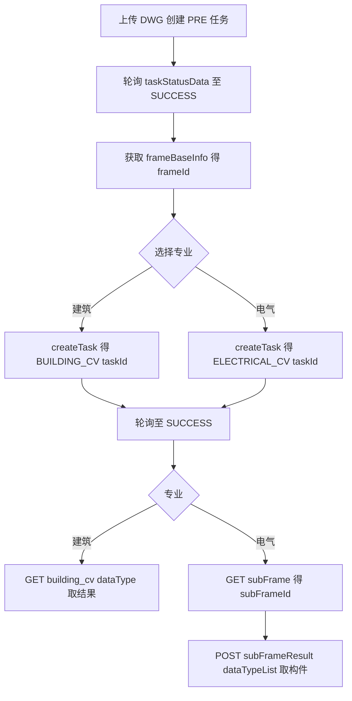

# bangtu-open-mcp 接口契约与工具设计文档

> 状态：建筑专业已发布；电气专业暂缓发布，等待上游 API 上线
> 目标：将帮图开放 API 的接口契约固化进 MCP 工具定义，使文档页面下线后 MCP 仍能独立工作，让 agent 开箱即用地拿到 DWG 图纸解析内容。

---

## 1. 背景与目标

当前 [`src/index.ts`](../src/index.ts) 是一个"泛化透传代理"，存在三个致命问题：

1. **基础地址错误**：代码写的是 `https://api.bangtu-ai.com`，真实地址是 `https://openapi.bangtu-ai.com/openApi`。
2. **认证方式错误**：代码默认 `Authorization: Bearer`，真实认证是 Header `apiKey: {key}`。
3. **缺失文件上传**：DWG 任务创建需要 `multipart/form-data` 上传文件，当前只支持 JSON body。

此外，4 个工具都是让 agent 自己填 `endpoint`/`path` 的空壳，未固化任何接口契约。

### 设计目标

- 修正 base URL、认证方式、响应结构处理。
- 将接口路径、方法、参数、枚举值固化进每个工具的 description 与 inputSchema。
- 增加 `multipart/form-data` 文件上传能力。
- 以"通用操作层 + 分结果形态的结果层"划分工具，兼顾精简与可扩展。

---

## 2. 通用契约

| 项目 | 值 |
|------|-----|
| 基础地址 | `https://openapi.bangtu-ai.com/openApi` |
| 认证 | Header `apiKey: {API_KEY}` |
| 响应包裹 | `{ code, message, data, timestamp }` |
| 业务成功 | `code === 200` |
| 业务失败 | `code === 500`（另有 500001 / 500003 / 401 / 2034 / 2003 等错误码） |
| 时间戳 | `timestamp`，毫秒 |

> 注意：业务成功与否以 `code` 字段为准，不是 HTTP 状态码。`code === 200` 才算成功；任务是否真正完成以 `data.status`（`RUNNING` / `SUCCESS` / `FAILED`）为准。

### 测试凭证（快速联调用）

- 测试 API Key：`btzlbnfhwr1dkndirgq5h6gy3838b8rh`

---

## 3. 接口路径映射

### 3.1 DWG 图纸基本信息识别（任务类型 `PRE`）

| 操作 | Method | Path | 请求方式 | 关键参数 |
|------|--------|------|----------|----------|
| 创建任务 | POST | `/pre/createPreTask` | `multipart/form-data` | `file`（DWG 文件） |
| 查询状态 | GET | `/result/taskStatusData` | query | `taskId` |
| 获取图框结果 | GET | `/result/pre/frameBaseInfo` | query | `id`（即 taskId） |

### 3.2 建筑构件识别（任务类型 `BUILDING_CV`）

| 操作 | Method | Path | 请求方式 | 关键参数 |
|------|--------|------|----------|----------|
| 创建任务 | POST | `/cv/building_cv/createTask` | `application/x-www-form-urlencoded` | `frameId` |
| 查询状态 | GET | `/result/taskStatusData` | query | `taskId` |
| 获取结果 | GET | `/result/building_cv/{dataType}` | query | `id`（即 taskId） |

建筑结果接口统一走 `GET /result/building_cv/{dataType}?id=`，`dataType` 见 6.2 节枚举（共 23 种）。

### 3.3 电气构件识别（暂未发布）

电气上游 API 尚未上线，当前 MCP 不注册电气工具，也不接受 `product: "electrical"`。以下接口契约仅作为后续恢复实现的设计记录，暂不属于当前发布版本：

| 操作 | Method | Path | 请求方式 | 关键参数 |
|------|--------|------|----------|----------|
| 创建任务 | POST | `/cv/electrical_cv/createTask` | `application/x-www-form-urlencoded` | `frameId` |
| 查询状态 | GET | `/result/taskStatusData` | query | `taskId` |
| 获取子图框 | GET | `/result/electrical_cv/subFrame` | query | `id`（即 taskId） |
| 获取构件结果 | POST | `/result/electrical_cv/subFrameResult` | `application/json` | `taskId`、`subFrameId`、`dataTypeList` |
| 获取图框文字 | GET | `/result/electrical_cv/texts` | query | `id`（即 taskId） |

> 电气与建筑的本质差异：电气是“一个统一结果接口 + `dataTypeList` 枚举筛选（110+ 种构件）”，且多一步“子图框”中间层；待上游接口上线后再恢复实现。

---

## 4. 工具设计（6 个）

### 4.1 通用操作层（跨专业复用）

#### `bangtu_create_dwg_task`
上传 DWG 文件，创建图纸基本信息识别任务。

| 参数 | 类型 | 必填 | 说明 |
|------|------|------|------|
| `filePath` | string | 二选一 | MCP 服务器可访问的本地 DWG 文件绝对路径 |
| `fileUrl` | string | 二选一 | 可公开下载的 DWG 文件 URL |

返回 `data.taskId`（字符串，勿转数字）。

#### `bangtu_create_cv_task`
根据 `frameId` 创建专业构件识别任务。

| 参数 | 类型 | 必填 | 说明 |
|------|------|------|------|
| `product` | enum | 是 | `architecture` / `electrical` |
| `frameId` | string | 是 | 取自图框基本信息结果 |

内部路由：`architecture` → `/cv/building_cv/createTask`；`electrical` → `/cv/electrical_cv/createTask`。

#### `bangtu_get_task_status`
查询异步任务状态（所有任务类型通用），并引导 agent 正确轮询。

| 参数 | 类型 | 必填 | 说明 |
|------|------|------|------|
| `taskId` | string | 是 | 任务 ID（字符串） |

**工具 description（给 agent 的完整轮询引导）**：

> 查询帮图异步识别任务状态。任务为异步执行，返回 `data.status`：
> - `RUNNING`：任务执行中，请等待 3~5 秒后再次调用本工具查询。
> - `SUCCESS`：任务完成，可继续调用对应的结果获取工具。
> - `FAILED`：任务失败，请查看 `data.logs` 了解原因。
>
> 注意：DWG 图纸解析是耗时操作，复杂图纸最长可能需要约 2 小时，请耐心多次轮询，不要因短时间未完成而判定失败。判断任务是否完成以 `data.status` 为准，而非本次查询的 `code` 字段。

**返回内容设计**：返回 `data`（含 `status`、`logs`、`type`、`createTime`、`endTime`），并附加 `_hint` 字段给出下一步建议：
- `RUNNING` → `任务仍在执行中，建议 5 秒后再次查询。复杂图纸最长可能需约 2 小时。`
- `SUCCESS` → `任务已完成，可调用结果获取工具。`
- `FAILED` → `任务失败，请查看 data.logs。`

> 通过"description 引导 + 每次返回带 `_hint`"形成轮询闭环，agent 无需任何外部知识即可正确等待异步任务完成。

### 4.2 结果获取层（按结果形态区分）

#### `bangtu_get_frame_result`
获取 DWG 图纸基本信息识别结果（图框列表）。

| 参数 | 类型 | 必填 | 说明 |
|------|------|------|------|
| `taskId` | string | 是 | PRE 任务 ID |

内部路由：`GET /result/pre/frameBaseInfo?id={taskId}`。返回 `data` 图框数组（`frameId`、`signInfo` 图签内容、`rotation` 等）。

#### `bangtu_get_arch_result`
获取建筑构件识别结果（轴号、房间、门窗、楼梯、文字等 23 种）。

| 参数 | 类型 | 必填 | 说明 |
|------|------|------|------|
| `taskId` | string | 是 | BUILDING_CV 任务 ID |
| `dataType` | enum | 是 | 见 6.2 节建筑 dataType 枚举 |

内部路由：`GET /result/building_cv/{dataType}?id={taskId}`。

#### `bangtu_get_electrical_result`
获取电气构件识别结果（两步：子图框 → 构件结果）。

| 参数 | 类型 | 必填 | 说明 |
|------|------|------|------|
| `taskId` | string | 是 | ELECTRICAL_CV 任务 ID |
| `subFrameId` | string | 否 | 子图框 ID；不传时先返回子图框列表 |
| `dataTypeList` | string[] | 否 | 构件类型列表，见 6.3 节；不传返回全部 |

行为约定：
- 未传 `subFrameId` 时，调用 `GET /result/electrical_cv/subFrame?id=` 返回子图框列表，引导 agent 选择 `subFrameId`。
- 传入 `subFrameId` 时，调用 `POST /result/electrical_cv/subFrameResult`（JSON body `{taskId, subFrameId, dataTypeList}`）返回构件结果。

---

## 5. 文件上传方案

DWG 创建任务需要 `multipart/form-data` 上传 `file` 字段。MCP 工具参数是 JSON，无法直接传二进制，采用以下三种方式（二选一提供文件）：

| 方式 | 参数 | 适用场景 | 优缺点 |
|------|------|----------|--------|
| 本地路径 | `filePath` | MCP 服务器与文件同机 | 简单、直接；要求共享文件系统 |
| 远程 URL | `fileUrl` | 文件在对象存储/公网 | 灵活；需 MCP 中转下载 |
| Base64（可选增强） | `fileBase64` + `fileName` | agent 已持有文件内容 | 纯 JSON；体积膨胀 33%，大文件受限 |

### 推荐实现

1. 首期支持 `filePath` 与 `fileUrl`（二选一）。
2. 服务端读取文件字节后，用 `FormData`（Node 18+ 原生 `fetch` 的 `FormData` + `Blob`，或 `form-data` 库）构造 `multipart/form-data`，字段名为 `file`，附文件名。
3. `fileUrl` 先 `fetch` 下载到内存，再上传。
4. 后续如需要可增加 `fileBase64` + `fileName`。

> 参考 curl：`curl -X POST {base}/pre/createPreTask -H "apiKey: xxx" -F "file=@example.dwg"`。

---

## 6. 枚举定义

### 6.1 `product` 枚举

当前发布版本仅开放：

| 值 | 说明 | 任务类型 |
|----|------|----------|
| `architecture` | 建筑构件识别 | `BUILDING_CV` |

> 电气 `electrical` 以及 `structure`、`hvac`、`plumbing` 均为预留能力，当前版本不注册、不调用，待对应后端接口上线后再开放。

### 6.2 建筑 `dataType` 枚举（`GET /result/building_cv/{dataType}`）

| dataType | 说明 |
|----------|------|
| `axisNumber` | 轴号 |
| `indexNumber` | 索引号 |
| `texts` | 图框文字 |
| `textelvation` | 标高符号（文档原文如此，疑似 textElevation 笔误，以线上为准） |
| `arrows` | 箭头 |
| `alignedDims` | 标尺线 |
| `subFrame` | 子图框基本信息 |
| `planRoom` | 平面房间 |
| `planStair` | 平面楼梯 |
| `planLift` | 平面电梯 |
| `planDoor` | 平面门 |
| `planWindow` | 平面窗 |
| `facadeStorey` | 立面楼层 |
| `sectionStorey` | 剖面楼层 |
| `stairPlanDetWall` | 楼梯详图平面墙体 |
| `stairPlanDetSeg` | 楼梯详图平面梯段 |
| `stairPlanDetPlatform` | 楼梯详图平面平台 |
| `stairPlanDetRail` | 楼梯详图平面栏杆 |
| `stairSecDetPlatform` | 楼梯详图剖面平台 |
| `stairSecDetSeg` | 楼梯详图剖面梯段 |
| `wallDetContour` | 墙身节点轮廓 |
| `doorWinDetail` | 门窗详图 |
| `doorWinTable` | 门窗表 |

> 建筑子图框（`subFrame`）返回字段是 `objId`（注意与电气的 `subFrameId` 不同），子图框类型：`PLAN` / `FACADE` / `SECTION` / `STAIR_DETAILED_PLAN` / `STAIR_DETAILED_SEC` / `STAIR_DETAILED_WALL`。

### 6.3 电气 `dataTypeList` 枚举（预留，当前未发布）

以下枚举仅保留用于后续恢复实现，当前 MCP 不会注册对应工具，也不会向 agent 暴露这些值。

`POST /result/electrical_cv/subFrameResult`：

电气有 110+ 种构件类型，来源为后端 [`DataTypeEnum.java`](../../bangtu-open-api-projects/bangtu-open-api/bangtu-open-api-core/src/main/java/com/bangtu/api/core/cv/electrical/base/subframe/DataTypeEnum.java)。以下为完整请求参数值：

```
all, axisNumber, circuitBreaker, isolationCircuitBreaker,
residualCurrentCircuitBreaker, isolationResidualCurrentCircuitBreaker,
isolationSwitch, contactor, cps, atse, thermalRelay, fuse, outlet,
generatrix, incomingLine, spd, scb, distributionBox, electricEnergyMeter,
currentTransformer, overUnderVoltageProtector,
emergencyLightingCentralizedPowerSupply, firePowerMonitoringModule,
electricalFireMonitoringModule, currentLimitingElectricalFireProtector,
busDuct, pluginBox, punctureClamp, transformer, dieselGeneratorSet, tse,
lightingTransformer, electricMotor, directionSignLamp, exitLamp,
floorSignLamp, lightingLamp, switchDevice, powerOutlet, mainEquipotentialBox,
localEquipotentialBox, groundWire, lightningStrip, lightningDownConductor,
cableTray, powerRoute, weakCurrentRoute, fireRoute, televisionOutlet,
telephoneOutlet, informationOutlet, homeWiringBox, emergencyHelpAlarm,
camera, doorContact, videoIntercomHost, videoIntercomExtension,
windowContact, infraredDetector, coConcentrationMonitor, cardReader,
pointSmokeDetector, pointHeatDetector, shortCircuitIsolator,
combustibleGasDetector, fireHydrantButton, manualFireAlarmButton,
fireTelephoneExtension, audibleVisualAlarm, fireBroadcast, broadcastModule,
fireDoorMonitoringModule, controlModule, moduleBox,
controlRoomExternalTelephone, areaDisplay, liquidLevelDisplay,
liquidLevelGauge, pressureSwitch, flowSwitch, fireTerminalBox,
waterFlowIndicator, signalValve, alarmValve, airOutlet, fireDamper70,
fireDamper150, fireDamper280, regionalFireAlarm, fireAlarmController,
fireLinkageController, multiLineManualControlPanel, graphicDisplayDevice,
controlRoomUps, combustibleGasDetectorHost, fireTelephoneHost,
fireBroadcastHost, firePowerMonitoringHost, electricalFireMonitoringHost,
fireDoorMonitoringHost, fireDoorMonitoringExtension, electricDoorCloser,
emergencyLightingController, gasFireExtinguishingController,
gasDischargeIndicator, dryPowderDischargeIndicator, emergencyStartStopButton
```

### 6.4 电气子图框类型

| 值 | 说明 |
|----|------|
| `FRAME_UNK` | 未知类型子图框 |
| `PLAN_DRAWING` | 平面图 |
| `SYSTEM_DRAWING` | 系统图 |

---

## 7. 响应结构处理

所有上游接口返回 `{ code, message, data, timestamp }`。MCP 层应做如下处理：

1. HTTP 层读取 JSON 后，检查 `code === 200`；否则抛错并携带 `code` + `message`。
2. 成功时返回 `data`（而非整包），减少 agent 解析噪音；同时在文本结果中保留 `message` 与 `timestamp` 供排查。
3. 任务状态接口需保留完整 `data`（含 `status`、`logs`），因为 agent 需要根据 `status` 决定是否继续轮询。

---

## 8. 时序流程



---

## 9. 未来扩展

- 结构 / 暖通 / 给排水专业上线后，按"结果形态"判断归属：
  - 若接近"建筑式多 GET 接口"，扩展 `bangtu_get_arch_result` 的 `dataType` 或新增结果工具。
  - 若接近"电气式子图框 + 枚举"，复用 `bangtu_get_electrical_result` 模式。
- `product` 枚举同步扩展，创建任务工具 `bangtu_create_cv_task` 内部路由表增加对应 `/cv/{xxx}_cv/createTask`。
- 文件上传如需支持远程大文件，再增加 `fileBase64` 或流式下载方案。

---

## 10. 待确认项

1. 建筑标高符号的 `dataType` 文档写的是 `textelvation`，需确认线上实际是否应为 `textElevation`。
2. 文件上传首期是否只需 `filePath` + `fileUrl`，是否需要 `fileBase64`。
3. `bangtu_get_electrical_result` 是否接受"未传 subFrameId 时自动返回子图框列表"的两段式行为。
